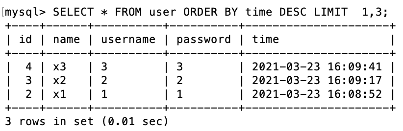

# 3. 基本的 SQL 指令

## ● 使用 INSERT 指令新增一筆資料到 user 資料表中，這筆資料的 username 和 password 欄位必須是 ply。

```bash
mysql> INSERT INTO user (`name`, `username`, `password`)
-> VALUES ('Yo', 'ply', 'ply');
```

這張圖片是後來加的,不是剛建立時照的


## 接著繼續新增至少 4 筆隨意的資料。

```bash
mysql> INSERT INTO user (`name`, `username`, `password`)
    -> VALUES ('x1', '1', '1');
Query OK, 1 row affected (0.01 sec)

mysql> INSERT INTO user (`name`, `username`, `password`)
    -> VALUES ('x2', '2', '2');
Query OK, 1 row affected (0.01 sec)

mysql> INSERT INTO user (`name`, `username`, `password`)
    -> VALUES ('x3', '3', '3');
Query OK, 1 row affected (0.00 sec)

mysql> INSERT INTO user (`name`, `username`, `password`)
    -> VALUES ('x4', '4', '4');
Query OK, 1 row affected (0.01 sec)
```

## ● 使用 SELECT 指令取得所有在 user 資料表中的使用者資料。

```bash
SELECT username FROM user;
```

   

## ● 使用 SELECT 指令取得 user 資料表中總共有幾筆資料。

```bash
SELECT COUNT(*) FROM user;
```

   

## ● 使用 SELECT 指令取得所有在 user 資料表中的使用者資料，並按照 time 欄位，由近到遠排序。

```bash
SELECT username FROM user ORDER BY time DESC;
```

   

## ● 使用 SELECT 指令取得 user 資料表中第 2 ~ 4 共三筆資料，並按照 time 欄位，由近到遠排序

```bash
SELECT * FROM user ORDER BY time DESC LIMIT  2,3;
```

   
   
 ## ● 使用 SELECT 指令取得欄位 username 是 ply 的使用者資料。
 
 ```bash
 SELECT * FROM user WHERE username = 'ply';
 ```

## ● 使用 SELECT 指令取得欄位 username 是 ply、且欄位 password 也是 ply 的資料。

```bash
SELECT * FROM user WHERE username = 'ply' AND password = 'ply';
```


## ● 使用 UPDATE 指令更新欄位 username 是 ply 的使用者資料，將資料中的 name 欄位改成【丁滿】。

```bash
UPDATE user
-> SET name = '丁滿'
-> WHERE username = 'ply';
```


## ● 使用 DELETE 指令刪除所有在 user 資料表中的資料。

```bash
DELETE from user;
```

# 4. 結合資料表 SQL JOIN 的操作

# 1. 在資料庫中，建立新資料表，取名字為 message。資料表中必須包含以下欄位設定:

```bash
mysql> CREATE TABLE message(
    -> id BIGINT AUTO_INCREMENT,
    -> user_id BIGINT NOT NULL,
    -> content VARCHAR(255) NOT NULL,
    -> time DATETIME DEFAULT CURRENT_TIMESTAMP,
    -> PRIMARY KEY(id),
    -> FOREIGN KEY(user_id) REFERENCES user(id)
    -> );
```


# ● 使用 SELECT 搭配 JOIN 的語法，取得所有留言，資料中須包含留言會員的姓名。

```bash
SELECT name, content FROM user JOIN message ON user.id = message.user_id;
```


# ● 使用 SELECT 搭配 JOIN 的語法，取得 user 資料表中欄位 username 是 ply 的所有留言，資料中須包含留言會員的姓名。

```bash
SELECT name, content FROM user JOIN message ON user.id = message.user_id WHERE username = 'ply';
```


# 其他

## 登入 mysql

```bash
mysql -u root -p
```

## 1.秀出資料庫

```bash
SHOW DATABASES;
```


## 2.建立新的資料庫

```bash
CREATE DATABASE [mysqldb name];
```

## 3. 使用該資料庫

```bash
USE website;
```


## 4.建立新的資料庫

```bash
CREATE DATABASE [mysqldb name];
```

## 5. SHOW TABLES

```bash
SHOW TABLES;
```


## 6.建立新的 table

```bash
mysql> CREATE TABLE user(
    -> id BIGINT AUTO_INCREMENT,
    -> name VARCHAR(255) NOT NULL,
    -> username VARCHAR(255) NOT NULL,
    -> password VARCHAR(255) NOT NULL,
    -> time DATETIME DEFAULT CURRENT_TIMESTAMP NOT NULL,
    -> PRIMARY KEY(id)
    -> );
```

## 展示 column

```bash
SHOW COLUMNS FROM test;
```


## 刪除 table

```bash
DROP TABLE tablename
```

## 刪除 database

```bash
DROP DATABASE databasename
```

不錯的網站
https://www.makeareadme.com/

https://hevodata.com/learn/mysql-export-database-command-line/#m2s2

https://gist.github.com/KateChoo/e31a048727fa337924513f199eb1626b
https://gist.github.com/KateChoo/e31a048727fa337924513f199eb1626b
