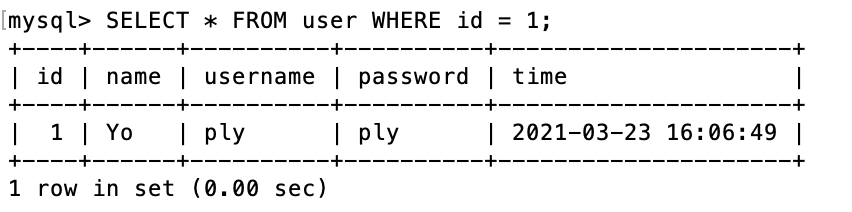
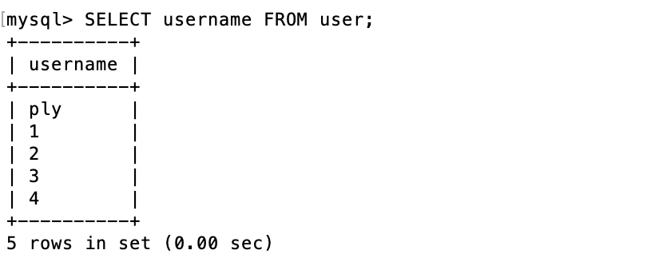

# 基本的 SQL 指令

## 登入 mysql

```bash
mysql -u root -p
```

## 秀出資料庫

```bash
SHOW DATABASES;
```

## 建立新的資料庫

```bash
CREATE DATABASE [mysqldb name];
```

## 使用該資料庫

```bash
USE website;
```

## 建立新的 table

```bash
mysql> CREATE TABLE user(
    -> id BIGINT AUTO_INCREMENT,
    -> name VARCHAR(255) NOT NULL,
    -> username VARCHAR(255) NOT NULL,
    -> password VARCHAR(255) NOT NULL,
    -> time DATETIME DEFAULT CURRENT_TIMESTAMP NOT NULL,
    -> PRIMARY KEY(id)
    -> );
```

## 刪除 table

```bash
DROP TABLE tablename
```

## 刪除 database

```bash
DROP DATABASE databasename
```

## 展示 column

```bash
SHOW COLUMNS FROM test;
```

1. SHOW DATABASES;
   
2. USE website;
   
3. SHOW TABLES;
   
4. SHOW COLUMNS FROM user;
   
5. INSERT user1
   
6. SELECT \* FROM user;
   
7. SELECT COUNT(\*) FROM user;
   
8. SELECT username FROM user ORDER BY time DESC;
   
9. SELECT \* FROM user WHERE id BETWEEN 2 AND 4 ORDER BY time DESC;
   
10. SELECT \* FROM user WHERE username = 'ply' AND password = 'ply';
    
11. UPDATE user
    
